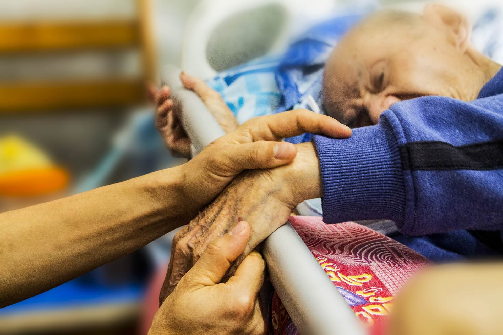

# End-of-Life Moral Dilemmas
==================================

*image of an elderly man's being cared. Photo Credit: [Pixabay](https://pixabay.com/en/hospice-caring-elderly-old-1761276/)*

Overview
--------
Suppose one of your loved ones is on her death bed with no hope of recovery and has just slipped into a coma. Imagine also that the medical staff has come to you asking for direction as to how to proceed. They present you with a number of options. They could maintain your loved one’s life for quite some time in this vegetative state or they could withdraw the life-saving equipment and allow your loved one to die probably in the next four to six hours. They could even administer a lethal injection and intentionally bring about the death of your loved one at the time of your choosing.

What should you do? Are you obligated, ethically, to use every medical means at your disposal to keep your loved one alive as long as possible? Or does there come a point when you are morally free to remove the life-saving technology and allow your loved one to die? If so, at what point does this become an ethically acceptable option and why? What basis is there for choosing this time as opposed to a few days earlier, or later?

To take this one step further, does there ever come a time when you are morally free, or even obligated, to ask the medical staff to administer a painless lethal injection and intentionally end the life of your loved one? Would this course of action be compatible with your desire to be charitable to your loved one, or with your deep respect for human dignity in general?

What if your loved one had previously asked you to have a lethal injection administered if she ever became unable to make her own life decisions? Does this change your moral obligation?

Welcome to unit eight. In this unit, we turn our attention to moral dilemmas like these, ones surrounding the end of life. Two things are immediately true of these dilemmas: first, they present some of the toughest choices many of us will make in our lives, and second, few of us will be able to avoid these choices forever. At some point, most of us will be called upon to make difficult decisions about end-of-life care for someone.

In end-of-life dilemmas, situations vary greatly and the details matter. The key question for us as we examine these situations from an ethical standpoint is whether there are any guiding principles which can be applied to these different situations to give us moral direction?

Cases like the one above are difficult. In this unit we will read about concepts like **voluntary euthanasia**, **nonvoluntary euthanasia**, **passive euthanasia**, and **active euthanasia**. It will be important to grasp how each of these concepts is similar to and yet distinct from the others.

This unit will also address another, very different, end-of-life ethical dilemma, namely the question of capital punishment. Rather than considering the best choice for a loved one on her death bed, we are now asking what, morally, should be done by the state to someone who has committed heinous crimes such as rape or murder.

Do principles of justice either allow or mandate the execution of such a person? Or do they rule out capital punishment as unjust and immoral in every situation? The way we decide these questions matters greatly to our world and we need to decide them on the basis of relevant moral principles.
Let’s prepare for some moral choices we may well have to make in the future.

Topics
------

This unit is divided into three topics:
1.  Active & Passive Euthanasia
2.  Capital Punishment: A Defense
3.  How to Reason Ethically About Capital Punishment

Learning Outcomes
-----------------

When you have completed this unit you should be able to:
-   Describe key concepts in the euthanasia discussion including euthanasia, active euthanasia, passive euthanasia, voluntary euthanasia, non-voluntary euthanasia, and killing versus letting die.
-   Explain James Rachels’ moral equivalency argument concerning active euthanasia and passive euthanasia.
-   Articulate John Stuart Mill’s case for the moral permissibility of capital punishment.
-   Discuss the strongest objections to the case for capital punishment.

Activity Checklist
------------------

Here is a checklist of learning activities you will benefit from in completing
this unit. You may find it useful for planning your work.

[plugin:content-inject](_schedule)

#####Activity 8.1: Read, View and Reflect
:fa-book:  Read the section on euthanasia by James Rachels (pages 372-378) and Philippa Foot (379-388) in your *Readings* textbook. Watch the video related to the topic.

---
##### Activity 8.2: Read, View and Reflect
:fa-book: Read the section on capital punishment by John Stuart Mill (390-397) in your *Readings* textbook. Watch the videos related to the topic.             

---
##### Activity 8.3: Read, View and Reflect
:fa-book: Read the section on euthanasia by Hugo Adam Bedau (pages 397-406) in your *Readings* textbook.

---
##### Activity 8.4: Smith and Jones Case Study
:fa-book:  Read and analyze the case study presented.

---
##### Activity 8.5: Key Terms Quiz
:fa-pencil: Take the ungraded quiz to review important concepts.

---
##### **Assignment**
:fa-pencil: Reflective Journal (5%)

Resources
---------

Here are the resources you will need to complete this unit.
-   Wolff, Jonathan.  *Readings in Moral Philosophy*.  New York: W. W. Norton & Company, 2018.
-   Other online resources will be provided in the unit

Topic 1: Active & Passive Euthanasia
------------------------------------
**Active euthanasia** occurs when steps are taken to euthanize a person, perhaps by giving a lethal injection or an overdose of pain-killers. **Passive euthanasia** happens when life-saving medical equipment is either withheld or withdrawn from a person with the intention of letting that person die from their underlying disease or condition.
Are active and passive euthanasia morally equivalent to each other? In other words, is one of these just as good (or bad) as the other, or is one morally worse than the other? How does one decide a question like this?
Related to this question is the distinction between **killing** and **letting die**. Most of us would probably instinctively view killing as morally worse than letting die, but in the reading by American ethicist, James Rachels, we will have an opportunity to think through this question and test our moral intuitions.
If all other factors were the same, asks Rachels, such as our motives and purposes in acting, would killing a person be morally worse than letting that same person die? His answer may surprise you. The way we reply to this question will have far-reaching implications for our views concerning passive euthanasia and physician-assisted suicide.

### Learning Activities
[plugin:content-inject](../_8-1)

#### Activity 8.1: Read, View and Reflect
In the first activity, you are asked to read the section on euthanasia by James Rachels (pages 372-378) and Philippa Foot (379-388) in your textbook, *Readings in Moral Philosophy* by Jonathan Wolff. As you read, take notes in your Learning Journal, defining key terms and explaining key concepts.
Next, choose from the following videos to learn more about key terms from this
topic.

[plugin:youtube](https://www.youtube.com/watch?v=3IsloHmKvWA)
Note that the first part of the video focusses on abortion, but it relevant to the discussion on euthanasia. If you prefer to skip ahead, go to 6:42 minute mark for euthanasia-specific content.

Topic 2: Capital Punishment: A Defense
--------------------------------------
The issue of capital punishment presents us with a starkly different kind of end-of-life ethical question. We are no longer considering our best course of action toward our loved ones who are suffering or dying. Rather we are asking how someone who has committed vile crimes should be treated by their governments.
Specifically, we are asking whether there are cases in which justice would allow for, or even require, a state to execute such a person. The challenge for all of us is to move beyond how we may feel toward people who have committed atrocious crimes, especially if they were against one of our loved ones, and ask if principles of justice would call for their execution.
We will read a well-known case in favour of capital punishment by John Stuart Mill who argues on utilitarian grounds that having this option available will lead to better consequences for a society than ruling it out. It will be important for us to consider his arguments and see whether we agree with him or not.
### Learning Activities
[plugin:content-inject](../_8-2)

#### Activity 8.2: Read, View and Reflect

Read the section on capital punishment by John Stuart Mill (390-397) in your
textbook, *Readings in Moral Philosophy* by Jonathan Wolff. Take notes defining
key terms and ideas. Study the chapter review summary, questions and key terms.
Next, choose from the following videos to learn more about key terms from this topic.

[plugin:youtube](https://www.youtube.com/watch?v=8dnVZibrV6g)
[plugin:youtube](https://www.youtube.com/watch?v=H0CTHVCkm90)
[plugin:youtube](https://www.youtube.com/watch?v=sujAXjmjrpA)

Topic 3: How to reason ethically about Capital Punishment
---------------------------------------------------------
In the previous topic, we learned how one thinker reasons in defense of capital punishment. Could it be, however, that neither side on this issue has conclusive arguments. That is the view of Hugo Bedau, an American political philosopher who has written an article we will read for this topic.
How, then, should one proceed in figuring out this issue? Bedau contends that, since neither those who argue **for** or **against** bring overwhelming supporting arguments, a better way forward is to shift our focus to the **goals** of punishment in the first place.
In other words, according to Bedau, the first question to ask is not whether capital punishment is ever morally justified, but rather, **what we are trying to accomplish by punishing** those who have committed vile crimes. Why do we punish them? What do we hope will be the outcome of our punishment? Different answers may be given to this question. Let’s read Bedau’s article to see how he answers it, and then see if this provides help in answering the larger question concerning the morality of capital punishment.

### Learning Activities
[plugin:content-inject](../_8-3)
#### Activity 8.3: Read, View and Reflect

Read the section on euthanasia by Hugo Adam Bedau (pages 397-406) in your
textbook, *Readings in Moral Philosophy* by Jonathan Wolff. Take notes defining
key terms and ideas. Study the chapter review summary, questions and key terms.

[plugin:content-inject](../_8-4)

#### Activity 8.4: Case Study

Read the following case study and consider the questions presented.
!!! Analyze James Rachels’ ‘Smith and Jones’ example from his article in the course readings.  Drawing upon the arguments from all the readings for this unit, tell whether you agree with his conclusion that this example shows that in cases like this, killing a person is no worse morally than letting that same person die, that these two actions are morally equivalent?  Why or why not? Then explain why Don Marquis would probably disagree with Rachels’ conclusion.
*Note that you may be asked to review this case or similar cases in your class discussion groups. You may want to prepare by relating the case to your readings. Specifically, identify the ethical issues and terms to help explain the case.*

[plugin:content-inject](../_8-5)
#### Activity 8.5: Key Terms Quiz (ungraded)
In order to review some of the major concepts from the text, take the following unmarked quiz. Although you will not be evaluated on these terms, they will assist you in the assignments for this course.
Match the following terms to their correct definition.

 [h5p id="11"]

title: Assessment
date: '00:33 11-12-2018'
hide_page_title: false
hide_git_sync_repo_link: false
---
### Assignment: Reflective Journal (5%)
After completing this unit, including the learning activities, you are asked to write about what you have learned in this unit.
State John Stuart Mill’s case for the moral permissibility of capital punishment and show how it grows out of his utilitarian perspective.  Then explain a number of questions Hugo Bedau would raise about the argument made by Mill. Tell why, in the end, he would favour the abolition of capital punishment.  Finally, discuss which view, Bedau’s or Mill’s, you would prefer and why.
#### Discussion Responses
After you have finished your journal assignment, you will share your responses in class with your peers. Refer to the **grading criteria** in the Assessments section of this course. Be sure to include your initial journal response, as well as ideas from your class discussion. Submit your assignment on Moodle by the end of the week.

Checking your Learning
----------------------

Before you move on to the next unit, you may want to check to make sure that you
are able to:
-   Describe key concepts in the euthanasia discussion including euthanasia, active euthanasia, passive euthanasia, voluntary euthanasia, non-voluntary euthanasia, and killing versus letting die.
-   Explain James Rachels’ moral equivalency argument concerning active euthanasia and passive euthanasia.
-   Articulate John Stuart Mill’s case for the moral permissibility of capital punishment.
-   Discuss the strongest objections to the case for capital punishment.
