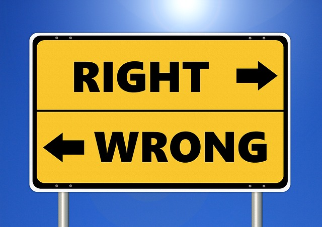

Unit 2: Foundational Moral Concepts
==========================================

Overview
--------

Welcome to Unit 2. You’ve probably noticed that every discipline or field of study including medicine, history, plumbing, auto mechanics, and philosophy has its own terminology or jargon, words that people within these fields of study use with each other. These terms convey important ideas and have been learned by the practitioners of the discipline along the way. To outsiders, they don’t mean much. To practitioners, they are the ideas of the trade and without a clear grasp of them, they simply could not do their jobs. Ethics, also, has its own key terms and, in this unit, we will turn our attention to some of the most important ones. The terms we will examine convey important ethical concepts, the ones we need to understand in order to carry out proper ethical inquiry. Once we have a clear working knowledge of them, we will be able to reflect on where we stand on the issues they raise. The positions we take on these concepts will have a great bearing on how we think about all ethical questions and dilemmas we face.

For example, have you ever wondered why there seem to be different moral views
and traditions in different places, cultures, societies, and even in different
times? Has it ever led you to wonder if there really is moral truth in any
objective sense? Or do moral teachings really come down to moral traditions, or
even personal opinions, which could have been different? In other words, is
moral **nihilism** true? How about **cultural relativism**, or **moral
subjectivism**?

Or could there be some moral principles and rules which are **objectively**
true? And what would it mean to say a moral claim is objectively true?

We can take this one step further because behind all of these questions there
seems to be a deeper assumption at work, namely, that human beings have **free
will**. After all, if we don’t, then what is the point of prescribing moral
directions about how we should or should not act? But are we as free as most of
us feel?

There are a number of views on this foundational question and in our readings we will come across such terms as **Libertarianism, determinism, and compatibilism**. Each of these views provides a different perspective on the question of free will and moral responsibility.

That is where we’re heading in this unit. As we’ve noted above, understanding these terms will allow us to reflect on them to see where we stand on the issues they raise. Once that process is under way, we’ll be ready to think clearly about the specific moral questions we will encounter in this course and in life. It will be a rewarding and useful journey.

Topics
------

This unit is divided into 3 topics:
1.  Moral Nihilism
2.  Moral Objectivism vs. Subjectivism
3.  Free Will and Moral Responsibility        

Learning Outcomes
-----------------

When you have completed this unit, you should be able to:
-   Define key terms, such as Moral Nihilism, Moral Subjectivism, Moral
    Objectivism, Free Will, Determinism, and Compatibilism.
-   Examine a case and suggest solutions, applying key concepts in moral
    discussions.

Activity Checklist
------------------

Here is a checklist of learning activities you will benefit from in completing
this unit. You may find it useful for planning your work.

[plugin:content-inject](_schedule)

Resources
---------

Here are the resources you will need to complete this unit.
-   Wolff, Jonathan.  *An Introduction to Moral Philosophy*.  New York: W. W.
    Norton & Company, 2018, (P. 40-69).
-   Other online resources will be provided in the unit.

*Photo Credit: [Pixabay](https://pixabay.com/en/ethics-right-wrong-ethical-moral-2991600/)*
