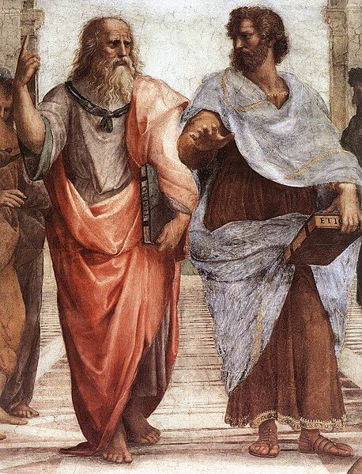

Unit 3: Why Be Moral?
=====================

Overview
--------

Welcome to Unit 3!

Suppose you learn that a colleague at work is overcharging for certain items and pocketing the difference? You, being an honest and loyal employee, immediately take him aside and urge him to stop, reminding him that his actions are not only harmful to the company and against policy, but they are simply immoral. To your surprise, your colleague retorts, “What I’m doing is harmless. The company is big enough that no one will even notice. I agree it’s immoral but why should I care about being moral?” How would you respond to this pointed question?

Have you ever wondered why you or anyone else should care about what is morally good or bad? Is it because you might get caught if you acted immorally, or because others would think less of you? What if you knew you would never get caught? Suppose no one, including God, would ever know if you acted unethically in a certain situation and, thus, no one would ever think less of you or treat you differently. Would you still choose the ethically good action? If so, why?

When we think about ethics, we are usually thinking of how to figure out ethical behaviour. But a deeper question, one that lies behind that question, is why anyone should be moral in the first place.

It is a question we cannot avoid forever because without an answer to it, the entire ethical enterprise is left hanging in the balance. Why put all this effort into trying to figure out what good ethical conduct is if there is no reason to pursue it in the first place? We must come up with some answer -- but how?

Furthermore, any discussion of the basis of our obligations toward other people immediately presents us with some deeper questions concerning our humanness. These include the following:
-   What does it mean to be human?
-   More importantly, what does it mean to be a person?
-   Are all humans persons by virtue of their humanness?
-   Alternatively, do persons have certain characteristics such as
    self-awareness, the ability to reason, or to carry out self-motivated
    activity, which certain humans have but others do not at certain stages of
    development?
-   If so, at what point do we become persons with all the rights of personhood? Is it at the point of conception, at birth, or at some point either between these two, or even after the point of birth?

The way we answer these questions will affect our views on such key ethical issues as **abortion, infanticide, euthanasia, physician-assisted suicide, contraception, in vitro fertilization**, etc. For example, if humans are persons with all the moral rights thereof from conception on, then abortion at any stage of development will be as immoral as ending the life of a three year old child. On the other hand, if humans do not have the rights of personhood until the point of birth, or until some other definite point of development, then abortion, even infanticide, may be morally permissible until they reach that point. Similar reasoning could be applied to the other issues mentioned here.

Rather than focus on these individual issues, in this unit we’ll try to
get behind them and explore the basis of our moral obligation. One thing to
remember is that when it comes to answering the question, ‘Why be moral?’ one
answer we cannot give is, “because it’s the right thing to do,” since, when we
ask, why be moral, we are asking precisely why we should care about doing the
right thing. How, then, can we answer it?

This question has been the subject of intense debate for thousands of years. In this unit, we’ll take a short journey down a fascinating trail of case studies, secondary questions, new terms, and different answers to the main question which have been tried out. We’ll come across terms like **Social Contract morality, psychological egoism** and **ethical egoism**. It is important to understand the meanings of these terms and the different perspectives they bring to our question, "Why be moral?" We’ll even see if evolutionary biology can help us answer this foundational question about morality. Get ready to read about **the selfish gene** and **kin altruism**.

Last, we’ll be introduced to the famous story of the Ring of Gyges, told by the ancient Greek philosopher, Plato. It’s one of the most intriguing stories of all time relating to the question, why be moral, and it focuses our thoughts on this question. We’ll take some time on it in the learning activities for this unit. Once you’ve read it, it will set the stage for the different answers we’ll see to the question.

Let’s plunge in. Why be moral?

Topics
------

This unit is divided into 2 topics:
1.  Egoism & Self-interest Morality
2.  Social Contract Morality

Learning Outcomes
-----------------

When you have completed this unit, you should be able to:
-   Explain key ethical concepts such as ethical egoism, psychological egoism,
    self-interest morality, and kin altruism.
-   Discuss knowledgeably Plato’s famous story of the Ring of Gyges.
-   Discuss whether people would do what is right, even if no one would find
    out.

Activity Checklist
------------------
Here is a checklist of learning activities you will benefit from in completing
this unit. You may find it useful for planning your work.
[plugin:content-inject](_schedule)

Resources
---------
Here are the resources you will need to complete this unit.
-   Wolff, Jonathan.  *An Introduction to Moral Philosophy*.  New York: W. W.
    Norton & Company, 2018.  
-   Other online resources will be provided in the unit.

*Photo Credit: [Wikipedia](https://en.wikipedia.org/wiki/Aristotle#/media/File:Sanzio_01_Plato_Aristotle.jpg)*
