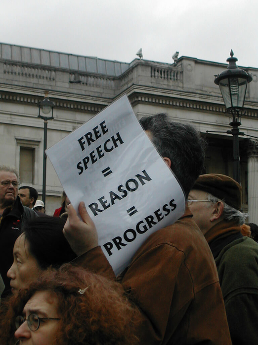

Unit 5: Free Speech and its Limits
==================================

Overview
--------
Welcome to Unit 5. In this unit we are turning our attention to the ethics of free speech and expression. You have probably noticed how deeply people value and appreciate the right to free speech. Many, in fact, would believe they, and their society, had lost something profoundly important if they ever lost this right.
In many countries, the right to free speech is seen as one of the foundations of society, as virtually an unquestioned cultural assumption. Those who dare to challenge, or even question, it do so at their peril. In other words, it is a foundational right upon which we base many other rights.
Perhaps you’ve wondered why this is so and how things got to be this way. How did the right to free speech gain such an elevated standing in people’s minds? Moreover, should it ever be limited or is it simply an absolute principle with no exceptions? If it should be limited, when, and why? What could possibly be so important that it would call for a limitation on one’s free speech?

Let’s begin by exploring our own personal views on the matter. Suppose someone you know believes something with which you and many of your friends flatly **disagree**. Should they have the right to express this belief? Most of us would probably answer, yes, to this question.
What, however, if you and your companions don’t simply *disagree* with this viewpoint but actually find it *disturbing*? Should the right to free speech and expression still hold?
Suppose it’s worse than that. Suppose you, and plenty of people you know, actually find this viewpoint *disgusting*? What then? Should the person still be given the right to express this view?
One last ‘what if’ question: what if you believe the expression of this viewpoint would be genuinely *dangerous* to some person or group of people in your society? Does the right to free speech guarantee their right to express the view even in this case?

The point of these ‘what if’ scenarios is to test our views on this right and to raise a critical question for this unit: how far does the right to free speech go? We will see that this question cannot be answered without first establishing the basis for free speech in the first place.
Notice that our basis for free speech cannot simply be that the government decrees this right, since the very question at stake is what moral basis governments have doing so. Our readings for this unit will expose us both to a proposed *moral foundation* for the right to free speech and a case for certain *limitations* to be placed upon it. Once we understand the arguments made for both, we will be in a position to reflect on them and decide whether we would draw the lines in different places than these authors have.

Topics
------

This unit is divided into two topics:
1.  A Moral Foundation for Free Speech
2.  Pornography and Limits on Free Speech

Learning Outcomes
-----------------

When you have completed this unit, you should be able to:
-   Explain John Stuart Mill’s four grounds for the freedom of expression.
-   Describe limitations on freedom of expression suggested by John Stuart Mill
    and his rationale for such limits.
-   Discuss why some who still favour freedom of speech believe pornography
    should not be freely distributed.
-   Show how John Stuart Mill’s Harm Principle is foundational to the question
    of when and why limits should be placed on free speech.

Activity Checklist
------------------

Here is a checklist of learning activities you will benefit from in completing
this unit. You may find it useful for planning your work.

[plugin:content-inject](_schedule)

Resources
---------

Here are the resources you will need to complete this unit.
-   Wolff, Jonathan.  *Readings in Moral Philosophy*.  New York: W. W. Norton &
    Company, 2018.
-   Other online resources will be provided in the unit.

*Photo Credit: [flickr photo by sjgibbs80](https://flickr.com/photos/sjgibbs/117704119)*
