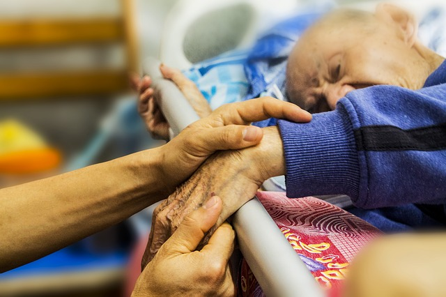

Unit 8: End-of-Life Moral Dilemmas
==================================

Overview
--------
Suppose one of your loved ones is on her death bed with no hope of recovery and has just slipped into a coma. Imagine also that the medical staff has come to you asking for direction as to how to proceed. They present you with a number of options. They could maintain your loved one’s life for quite some time in this vegetative state or they could withdraw the life-saving equipment and allow your loved one to die probably in the next four to six hours. They could even administer a lethal injection and intentionally bring about the death of your loved one at the time of your choosing.

What should you do? Are you obligated, ethically, to use every medical means at your disposal to keep your loved one alive as long as possible? Or does there come a point when you are morally free to remove the life-saving technology and allow your loved one to die? If so, at what point does this become an ethically acceptable option and why? What basis is there for choosing this time as opposed to a few days earlier, or later?

To take this one step further, does there ever come a time when you are morally free, or even obligated, to ask the medical staff to administer a painless lethal injection and intentionally end the life of your loved one? Would this course of action be compatible with your desire to be charitable to your loved one, or with your deep respect for human dignity in general?

What if your loved one had previously asked you to have a lethal injection administered if she ever became unable to make her own life decisions? Does this change your moral obligation?

Welcome to unit eight. In this unit, we turn our attention to moral dilemmas like these, ones surrounding the end of life. Two things are immediately true of these dilemmas: first, they present some of the toughest choices many of us will make in our lives, and second, few of us will be able to avoid these choices forever. At some point, most of us will be called upon to make difficult decisions about end-of-life care for someone.

In end-of-life dilemmas, situations vary greatly and the details matter. The key question for us as we examine these situations from an ethical standpoint is whether there are any guiding principles which can be applied to these different situations to give us moral direction?

Cases like the one above are difficult. In this unit we will read about concepts like **voluntary euthanasia**, **nonvoluntary euthanasia**, **passive euthanasia**, and **active euthanasia**. It will be important to grasp how each of these concepts is similar to and yet distinct from the others.

This unit will also address another, very different, end-of-life ethical dilemma, namely the question of capital punishment. Rather than considering the best choice for a loved one on her death bed, we are now asking what, morally, should be done by the state to someone who has committed heinous crimes such as rape or murder.

Do principles of justice either allow or mandate the execution of such a person? Or do they rule out capital punishment as unjust and immoral in every situation? The way we decide these questions matters greatly to our world and we need to decide them on the basis of relevant moral principles.
Let’s prepare for some moral choices we may well have to make in the future.

Topics
------

This unit is divided into three topics:
1.  Active & Passive Euthanasia
2.  Capital Punishment: A Defense
3.  How to Reason Ethically About Capital Punishment

Learning Outcomes
-----------------

When you have completed this unit you should be able to:
-   Describe key concepts in the euthanasia discussion including euthanasia, active euthanasia, passive euthanasia, voluntary euthanasia, non-voluntary euthanasia, and killing versus letting die.
-   Explain James Rachels’ moral equivalency argument concerning active euthanasia and passive euthanasia.
-   Articulate John Stuart Mill’s case for the moral permissibility of capital punishment.
-   Discuss the strongest objections to the case for capital punishment.

Activity Checklist
------------------

Here is a checklist of learning activities you will benefit from in completing
this unit. You may find it useful for planning your work.

[plugin:content-inject](_schedule)

Resources
---------

Here are the resources you will need to complete this unit.
-   Wolff, Jonathan.  *Readings in Moral Philosophy*.  New York: W. W. Norton & Company, 2018.
-   Other online resources will be provided in the unit

*Photo Credit: [Pixabay](https://pixabay.com/en/hospice-caring-elderly-old-1761276/)*
