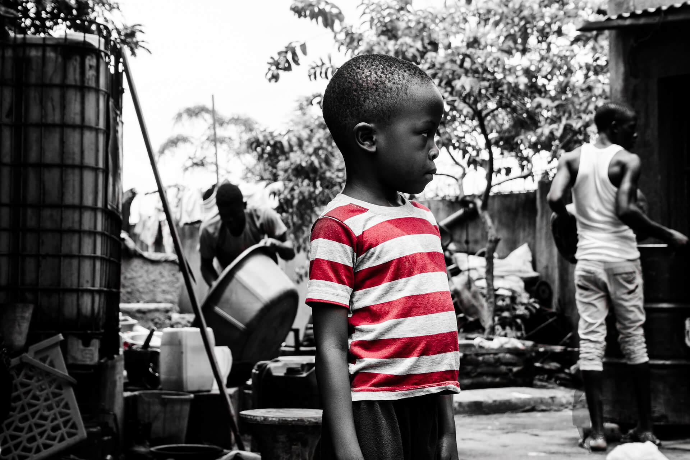

Unit 10:  World Hunger and Foreign Aid
=====================================

Overview
--------
Do people in prosperous countries have a moral obligation to provide help to other people in parts of the world where they do not have their basic needs satisfied? If so, why, and how should they carry out this moral obligation?

Clearly there are some people in the world, many people, who *could* send food, clothing, money, medical equipment, etc., to others who do not have enough to survive on their own. This situation forces an ethical question upon us all: **If people can help in these ways, should they?** In other words, if people are *able* to help, are they, thereby, morally *obligated* to do so? Or is there no such moral obligation? Could it even be, as some argue, that we are morally required *not* to help, at least in ways that some people think we are?

The way we answer this question has some rather serious and unavoidable implications. If we answer, that we are, indeed, morally obligated to help if we can, we are then affirming that if people who can help do *not* do so, they are thereby acting immorally. They are violating their moral obligations in this regard.

Other questions immediately come to mind too. Does it matter if those in need are related to us, or known to us, or if they live close by, or happen to be in distant countries? Would it affect our moral obligations if there are other people who could be helping those in need but aren’t? Is our moral obligation dependent upon factors like distance, relationships, other people’s actions, etc., or does it stand completely independent of them?

In this unit we will become acquainted with three very different viewpoints on this question. This will provide us an opportunity to compare these different perspectives and assess them. Which one, or ones, do we agree with, and why? Is one ethically superior to the others? Again, why? To evaluate the various perspectives, we will first need to understand and evaluate the *basis* for each.

Topics
------
This unit is divided into 3 topics:
1.  A Proposed Basis for Moral Obligation
2.  Does our aid help or hurt?
3.  How to Think about Moral Obligation to those in need.

Learning Outcomes
-----------------

When you have completed this unit you should be able to:
-   Explain Peter Singer’s reasons for believing that people who are able to
    help others meet their basic needs have a moral obligation to do so.
-   Discuss the argument that the difference in physical proximity of the people
    needing aid is a morally insignificant difference.
-   Explain why Dambisa Moyo thinks foreign aid does more harm than good for the
    people it is intended to help.
-   Discuss ways in which both utilitarianism and Kant’s principle of treating
    people as ends in themselves can clarify and guide our discussion of the
    question of our duty to provide aid to others.

Activity Checklist
------------------
Here is a checklist of learning activities you will benefit from in completing this unit. You may find it useful for planning your work.
[plugin:content-inject](_schedule)

Resources
---------

Here are the resources you will need to complete this unit.
-   Wolff, Jonathan.  *An Introduction to Moral Philosophy*.  New York: W. W. Norton & Company, 2018.  
-   Wolff, Jonathan.  *Readings in Moral Philosophy*.  New York: W. W. Norton & Company, 2018.
-   Other online resources will be provided in the unit.

*Photo Credit: [Pixabay](https://pixabay.com/en/kid-child-sad-red-stripe-shirt-2101832/)*
